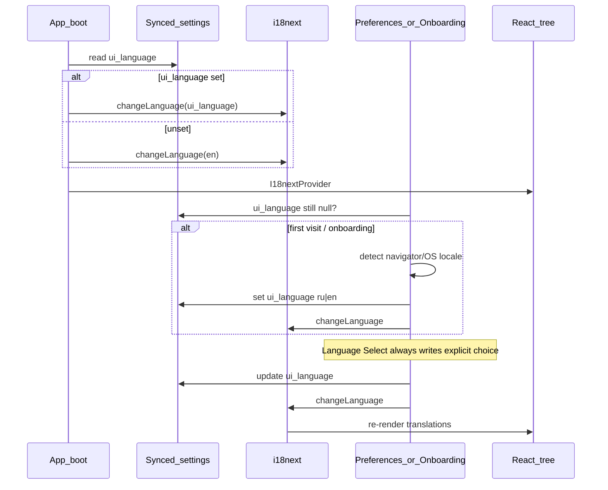

# UI i18n (en/ru) for fork stack — Design

**Date:** 2026-07-15  
**Status:** Draft for review  
**Scope:** Thunderbolt app UI + built-in defaults display names in the `metalmon/thunderbolt` fork, integrated with the Zeroclaw-style `master` + cherry-pick → `main` pipeline

## Problem

The app UI and shipped default entity names (modes / skills / tasks) are English-only hardcoding. There is no i18n framework, no `ui_language` setting, and no language switcher.

Existing Settings → **Localization** means regional preferences (units, currency, date/time, location) for AI/tools — not UI translation. Upstream (`thunderbird/thunderbolt`) has no public i18n/l10n backlog; a large unsolicited i18n PR is unlikely to land soon. The fork must therefore own i18n while staying cheap to rebuild onto fresh upstream via cherry-pick stack branches.

## Goal

Ship a fork-friendly UI localization system:

- Languages: **en** (source) + **ru**
- Full coverage of UI chrome and **built-in** defaults display names
- Language switcher in Settings → Localization
- Auto-detect once (onboarding or first Preferences visit)
- `ui_language` synced across devices (account setting)
- Patch layout compatible with `rebuild-main`: infra / wrap-* / locales as separate `$Branches` entries

## Non-goals (v1)

- Marketing site / `web/` docs
- Backend/API error message catalogs
- RTL layouts
- Controlling the language of model replies (orthogonal to UI locale)
- Translating user-created modes/skills/tasks or arbitrary chat content
- Adopting Mozilla Fluent (possible future upstream choice; not required for v1)

## Approaches considered

| | Approach | Pros | Cons |
|---|---|---|---|
| **1 (chosen)** | `i18next` + `react-i18next`, JSON namespaces, stable keys | Gradual wrap; namespaces map to stack branches; lazy load; familiar | Not Fluent; possible future migration if upstream standardizes elsewhere |
| 2 | Lingui macros + ICU | Strong extract/compile | More build tooling; macros worsen cherry-pick conflicts in JSX |
| 3 | Runtime English-string overlay | Minimal JSX churn | Fragile plurals/context; unsuitable for full coverage |

**Chosen: approach 1.**

## Architecture

### Branch stack (`$Branches` order)

1. **`feat/i18n-infra`** — i18next init, React provider, translation helpers, `ui_language` setting + reconcile version bump, auto-detect, Language select in Settings → Localization, English catalogs (all namespaces), empty or stub `ru` structure as needed for boot
2. **`feat/i18n-wrap-*`** — one concern per branch/namespace zone, e.g. `settings`, `chat`, `auth`, `tasks`, `onboarding`, … Replace hardcoded copy with `t('ns:key')`
3. **`local/i18n-locales`** — completed Russian catalogs (kept separate so translation edits do not rebase with wrap conflicts). If operationally simpler, `ru` may live inside infra initially; prefer split once wrap work starts

When upstream lands equivalent i18n, drop infra + wrap branches from `$Branches`; keep `local/i18n-locales` (or rehome onto upstream’s catalog layout).

### Additive layout

```
src/i18n/           # init, provider wiring helpers, defaults display helper
locales/
  en/
    common.json
    settings.json
    chat.json
    auth.json
    defaults.json
    …
  ru/
    …               # same namespaces
```

Thin upstream touch points only: app root (provider), preferences Localization section (switcher + detect trigger), default-entity list/detail render paths (display helper).

### Defaults (modes / skills / tasks)

- Synced DB / reconcile continue to store **upstream English** strings — do not rewrite stored defaults to Russian (avoids hash/reconcile ping-pong and keeps cherry-picks aligned with upstream content).
- At render time, for built-in ids:  
  `t(\`defaults:<kind>.<id>.name\`, { defaultValue: row.name })`  
  (and description fields similarly where shown).
- Custom / user-created entities: always show stored string; no translation lookup required beyond missing-key fallback.
- Key segments use stable entity ids (`mode-chat`, skill/task UUIDs as shipped).

### Message keys

- Stable keys only (e.g. `settings.localization.languageLabel`) — not English-as-msgid.
- Namespaces align with wrap branches to isolate conflicts.

## Data flow



### Language resolution

Priority: explicit `ui_language` → (only if unset, on detect trigger) OS/browser locale → `en`.

Detect mapping: `ru` / `ru-*` → `ru`; everything else → `en`. Detect runs at most once for unset setting (onboarding **or** first Preferences entry, whichever comes first) and must not overwrite a user-set value.

### Switcher UI

- Location: Settings → Localization (with existing units/currency controls).
- Control: select with `English` / `Русский` (labels can be language-native).
- On change: persist `ui_language` via existing settings DAL (same sync path as other settings) + `i18n.changeLanguage` without full app reload.
- Telemetry: extend `settings_localization_update` payload or add a dedicated event — implementation plan picks one; docs in `TELEMETRY.md` must match.

## Error handling and edge cases

| Case | Behavior |
|---|---|
| Missing key | Fallback to `en`, then `defaultValue` / source string; dev warning; prod no throw |
| Unknown `ui_language` | Treat as `en`; normalize on write to `en` \| `ru` |
| Settings write failure | Do not leave UI language and stored setting diverged; follow neighboring localization controls’ pattern (await persist then change, or optimistic + rollback) |
| Pluralization | Use i18next plural forms from the start (`one`/`few`/`many`/`other` for `ru`) |
| Cherry-pick conflict | Resolve on the conflicting wrap branch only; locale JSON rarely conflicts with upstream |

## Testing

- Unit: language resolution order; detect mapping; unknown-code normalization; defaults display helper (built-in vs missing key vs custom).
- Component: Language select updates settings + i18n; smoke render of a settings surface under `ru` with incomplete catalog.
- Defaults/settings: `ui_language` in `defaultSettings`, bump `defaultSettingsVersion`, satisfy colocated snapshot test.
- Per wrap branch: typecheck + targeted `bun test` for touched areas.

## Definition of done (v1)

- [ ] Infra branch: provider, setting, detect, switcher, `en` catalogs
- [ ] `ru` catalogs complete for UI chrome + built-in defaults names
- [ ] Wrap branches cover all in-scope UI surfaces and are listed in `$Branches`
- [ ] Language syncs across devices via settings
- [ ] Pipeline note: how to add a namespace/wrap branch; how to drop branches if upstream adopts i18n
- [ ] Tests above green

## Open implementation details (plan, not product ambiguity)

- Exact namespace list and wrap-branch cut points
- Whether `ru` ships inside `feat/i18n-infra` or only in `local/i18n-locales` for the first rebuild
- Telemetry event shape for language changes
- Wire format of `ui_language` default row (`null` until detect vs explicit sentinel)
