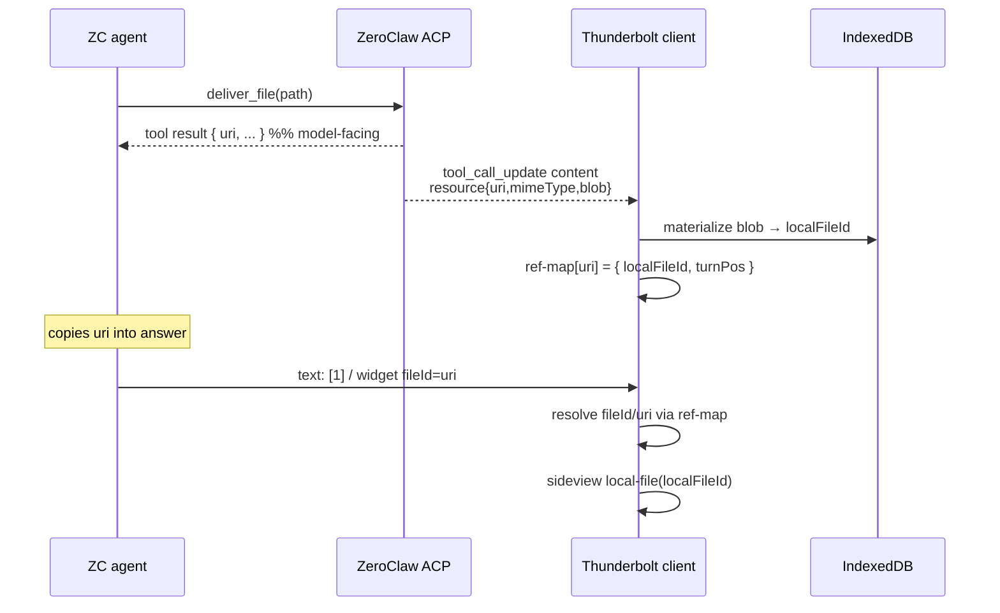
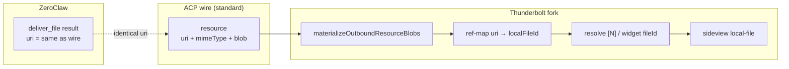

# Design: Citations / widgets / ACP deliver_file (Thunderbolt ↔ ZeroClaw)

**Date:** 2026-07-18  
**Status:** APPROVED — decisions frozen  
**Primary owner:** Thunderbolt fork (`zeroclaw-integration` + `src/fork/zeroclaw/`)  
**Companion:** ZeroClaw `docs/superpowers/specs/2026-07-18-deliver-file-return-uri-design.md`  
**Sequencing:** ZeroClaw first (`uri` in `deliver_file` result), then Thunderbolt (ref-map + resolve)

---

## 1. Problem / context

ZeroClaw already delivers workspace files to ACP clients via standard wire:

`deliver_file` → ACP `tool_call_update.content` → `resource { uri, mimeType, blob }`

with `uri = attachment://deliver/<basename>` (sha storage basename).

Thunderbolt already materializes outbound blobs into IndexedDB (`localFileId`) and shows a delivered-file card. What is still missing for a grounded ZC path:

1. The **model-facing** `deliver_file` tool result does not expose the same `uri` the client receives, so the agent cannot reliably cite or widget-link that file.
2. Assistant text may contain citation markers `[N]` and `<widget:document-result fileId=…>`. On the Haystack path these resolve via remote Deepset file ids + `GET /v1/haystack/files/:fileId`. On the ZeroClaw path there is **no** Haystack fetch — resolution must use locally materialized ACP blobs.
3. Pretty human names (`Договор.pdf`) must appear in UI, but **must not** extend the ACP resource schema (no `filename` on the wire).

This slice closes the citation/widget loop for ZeroClaw without inventing ACP protocol extensions and without removing Haystack.

---

## 2. Goals / non-goals

### Goals

| # | Goal |
|---|------|
| G1 | ZC: `deliver_file` model-facing result includes `uri` **identical** to ACP `resource.uri`. |
| G2 | TB: after materializing outbound blobs, maintain a **ref-map** `uri → localFileId` (+ turn position). |
| G3 | TB: resolve `[N]` and `<widget:document-result fileId=…>` via that map → sideview `local-file`. |
| G4 | Agent copies `uri` from tool result into widget `fileId` / markdown links — does not invent prefixes. |
| G5 | Pretty display name stays off ACP wire; agent takes it from MCP / `get_source_file` marker `[Document: name]` and puts it in widget `name=` or link text. |
| G6 | Fork maintainability: thick logic under `src/fork/zeroclaw/` + `zeroclaw-integration/`; thin hooks in upstream MPL files. |

### Non-goals

- No ACP protocol extension (`filename`, required `_meta`, custom ContentBlock types).
- No `git rm` / deletion of Haystack path in this slice.
- No Haystack → Deepset fetch on the ZeroClaw agent path.
- No auto-deliver (agent still calls `deliver_file` explicitly).
- No full citation UX redesign beyond resolve-to-local-file.
- No P1 ACP `image` / P2 `audio` ContentBlocks (orthogonal roadmap).

---

## 3. Frozen decisions (do not reopen)

1. **Standard ACP wire only for files:** `deliver_file` → `resource { uri, mimeType, blob }`.  
   `uri = attachment://deliver/<basename>` (sha storage name).  
   **No `filename` field on ACP resource. No required `_meta`.**
2. **ZC change:** model-facing `deliver_file` result (JSON + summary) **MUST** include `uri` identical to what the ACP client receives. Optional: keep existing fields. **Do NOT** add ACP protocol extension.
3. **Pretty display name:** NOT on ACP wire. Agent takes name from MCP / `get_source_file` marker `[Document: name]` → widget `name=` or markdown link text.
4. **TB:** client ref-map after materializing outbound blobs: `uri` → `localFileId` (+ turn position). Resolve `[N]` and `<widget:document-result fileId=…>` via map → `local-file` sideview. No Haystack fetch on ZC path.
5. Agent copies `uri` from `deliver_file` result into `fileId` / links — does not invent prefix.
6. Fork maintainability as in G6; do not git-rm Haystack in this slice.
7. Scope: ZC uri-in-result + TB ref-map + widget/`[N]` resolve + agent skill/prompt note. Sequencing: **ZC first, then TB**.

### Rejected: filename on ACP resource

**Rejected.** Adding `filename` (or any pretty-name field) to the ACP `resource` object is an ACP protocol extension. Pretty names belong in agent-authored UI text (`name=`, link labels), not on the wire. Storage basename stays in `uri`.

---

## 4. Architecture





---

## 5. Contracts

### 5.1 ACP wire (unchanged shape)

`tool_call_update.content` includes a nested content item:

```json
{
  "type": "content",
  "content": {
    "type": "resource",
    "resource": {
      "uri": "attachment://deliver/a1b2c3d4e5f6.pdf",
      "mimeType": "application/pdf",
      "blob": "<base64>"
    }
  }
}
```

Rules:

- `uri` scheme/prefix: `attachment://deliver/<basename>` where `<basename>` is the workspace/sha storage filename (may look opaque).
- Fields on `resource`: **only** `uri`, `mimeType`, `blob` (plus any fields already required by the ACP EmbeddedResource schema that ZC already emits). **No `filename`.**
- `_meta` is **not required** for this slice (Haystack `_meta.haystack*` remains Haystack-only).

### 5.2 ZeroClaw `deliver_file` model-facing result

Must include `uri` identical to §5.1.

Example JSON (existing fields optional to keep):

```json
{
  "ok": true,
  "uri": "attachment://deliver/a1b2c3d4e5f6.pdf",
  "path": "uploads/a1b2c3d4e5f6.pdf",
  "mimeType": "application/pdf",
  "bytes": 12345
}
```

Summary text may also carry the uri for models that skim text:

```text
Delivered a1b2c3d4e5f6.pdf (12345 bytes)
uri=attachment://deliver/a1b2c3d4e5f6.pdf
```

Exact summary formatting is an implementation detail; the **JSON field `uri` is mandatory** and must match the ACP resource.

Details: companion ZC spec.

### 5.3 Pretty name (not on wire)

From MCP / `get_source_file` (or inbound materialize) marker:

```text
[Document: Договор поставки.pdf] /abs/workspace/uploads/a1b2c3d4e5f6.pdf
```

Agent uses `Договор поставки.pdf` only in:

- widget attribute `name="Договор поставки.pdf"`
- markdown link text: `[Договор поставки.pdf](attachment://deliver/a1b2c3d4e5f6.pdf)` (if used)

### 5.4 Agent → TB citation / widget text

After `deliver_file`, agent copies **exactly** the returned `uri`:

```text
См. документ [1].

<widget:document-result name="Договор поставки.pdf" fileId="attachment://deliver/a1b2c3d4e5f6.pdf" snippet="…" />
```

Or, if the product still uses numeric citations tied to turn order:

```text
См. документ [1].
```

where `[1]` indexes the N-th successfully delivered outbound resource in the current turn (see §6).

**Forbidden:** inventing `local:…`, `haystack:…`, or bare UUIDs that were never returned by `deliver_file`.

### 5.5 TB ref-map entry (client-only)

Not on ACP wire. Conceptual shape after materialization:

```ts
type DeliveredUriRef = {
  uri: string           // attachment://deliver/<basename>
  localFileId: string   // IndexedDB id
  turnPosition: number  // 1-based order among delivered blobs in this turn/message
  mimeType: string
  storageBasename: string // from uri basename; not pretty name
}
```

---

## 6. TB resolve rules

Apply on the **ZeroClaw / standard-ACP** path only. Haystack path keeps existing remote fetch.

### 6.1 Build map

When ACP translator materializes outbound `resource`+`blob` (existing `materializeOutboundResourceBlobs`):

1. Decode blob → store in IndexedDB → `localFileId`.
2. Upsert ref-map: `uri → { localFileId, turnPosition, mimeType, storageBasename }`.
3. `turnPosition` = order of successful materializations in that assistant turn (1-based).

Scope of the map: at least the current chat turn / message that received the tool update. Persistence across reload may reuse IndexedDB + message parts; exact persistence API is implementation detail, but resolve must work for the live turn without Haystack.

### 6.2 Resolve `<widget:document-result fileId=…>`

| `fileId` value | Action |
|----------------|--------|
| Exact key in ref-map (`attachment://deliver/…`) | Open sideview `local-file` with mapped `localFileId`. Use widget `name=` for display title if present; else storage basename. |
| Already a known IndexedDB `localFileId` (legacy/local) | Existing local path (unchanged). |
| Haystack remote id on Haystack agent | Unchanged Haystack fetch. |
| Unknown on ZC path | Do **not** call Haystack. Show non-blocking failure / missing-doc UI. |

### 6.3 Resolve `[N]`

| Marker | Action |
|--------|--------|
| `[N]` where `N` matches `turnPosition` in current turn’s ref-map | Treat as citation to that delivered file → sideview `local-file`. |
| `[N]` with Haystack sources present (Haystack agent) | Existing Haystack citation path. |
| `[N]` with no matching delivered uri on ZC path | No Haystack fallback; ignore or show empty citation UI. |

If both numeric `[N]` and widget `fileId=uri` appear, both must resolve to the same local file when they refer to the same delivery.

### 6.4 Display name

- Prefer widget `name=` / markdown link text for UI labels.
- Never require ACP `resource.filename`.
- Storage basename from `uri` is a fallback label only.

---

## 7. File ownership / fork strategy

| Area | Location | Notes |
|------|----------|--------|
| Thick logic | `src/fork/zeroclaw/` | ref-map, resolve helpers, delivered-file / local citation glue |
| Integration docs/specs | `zeroclaw-integration/` | this spec, HAYSTACK-TO-ACP inventory |
| Thin hooks | MPL upstream files (`acp-to-ai-sdk.ts`, `assistant-message.ts(x)`, widget click handlers, etc.) | import fork helpers only; minimal diff |
| Haystack | `backend/src/haystack/`, `_meta.haystack*`, `/v1/haystack/files` | **Keep** in this slice |

Do **not** open upstream Thunderbolt PRs that include `src/fork/zeroclaw/` or this integration spec tree.

---

## 8. ZeroClaw change surface (pointer)

Minimal ZC work for this slice:

1. Add `uri` to `deliver_file` tool result (model JSON + optionally summary trailer).
2. Ensure ACP emitter already uses the **same** uri string (no second generator).
3. Agent skill / prompt note: copy `uri` into widgets/links; pretty name from `[Document: …]` only.

Full ZC contract:  
`E:\zeroclaw\docs\superpowers\specs\2026-07-18-deliver-file-return-uri-design.md`

Branching note (ZC): implement on a branch from `fork/main` or stacked on `feat/mcp-embedded-resource-blob-intake` (e.g. `feat/deliver-file-return-uri`). Do **not** mix into unrelated telegram work.

---

## 9. Agent skill / prompt note (TB + ZC)

Inject (ACP compose prompt and/or ZC skill) roughly:

```text
When deliver_file returns uri, cite that exact uri in
<widget:document-result fileId="<uri>" name="<pretty from Document marker>" … />
or as [N] matching delivery order. Do not invent fileId prefixes.
Pretty names come from [Document: …], never from uri basename alone if a Document marker exists.
```

---

## 10. Test plan (acceptance)

### ZeroClaw

- [ ] `deliver_file` success JSON contains `uri`.
- [ ] ACP `tool_call_update` resource `uri` **===** tool-result `uri` (same string).
- [ ] Failure paths still omit resource / uri as today.
- [ ] No `filename` field on ACP resource object.

### Thunderbolt (ZC path)

- [ ] Materializing outbound blob registers ref-map entry for that `uri`.
- [ ] Click / activate `<widget:document-result fileId="attachment://deliver/…">` opens `local-file` sideview with correct bytes; **zero** calls to `/v1/haystack/files`.
- [ ] `[N]` for N-th delivered blob in the turn opens the same local file.
- [ ] Widget `name=` shown as title; missing `name=` falls back to uri basename.
- [ ] Unknown `fileId` on ZC path does not hit Haystack.
- [ ] Haystack agent path still resolves remote ids (regression).

### Agent behavior (manual / eval)

- [ ] After deliver, agent reuses returned `uri` in widget/`[N]` without inventing prefixes.

---

## 11. Out of scope / follow-ups

- Removing Haystack remote proxy / `_meta.haystack*` entirely.
- Embedding Deepset source PDFs as outbound ACP blobs from the Haystack ACP server.
- ACP Image/Audio ContentBlocks (P1/P2).
- Optional `_meta.zeroclaw` session hints.
- Cross-session durable citation graph beyond local attachments.
- Upstream Thunderbolt contribution of fork helpers.

---

## 12. Short implementation outline (not a full plan)

1. **ZC:** return `uri` from `deliver_file`; single source for ACP emitter; tests; skill note.  
2. **TB:** extend materialize path → ref-map; wire widget + `[N]` resolvers to map; thin MPL hooks; tests; keep Haystack.  
3. Manual live: ZC ACP session → deliver → widget/`[N]` → local sideview.

Full step-by-step plan comes after user review of this spec (writing-plans).

---

## 13. Decision log

| Topic | Decision |
|-------|----------|
| ACP filename field | **Rejected** |
| Required `_meta` for ZC deliver | **Rejected** |
| Pretty name source | `[Document: name]` / agent UI text |
| Citation resolve on ZC | Client ref-map only |
| Haystack in this slice | Keep; dual path |
| Sequencing | ZC uri-in-result → TB ref-map/resolve |
